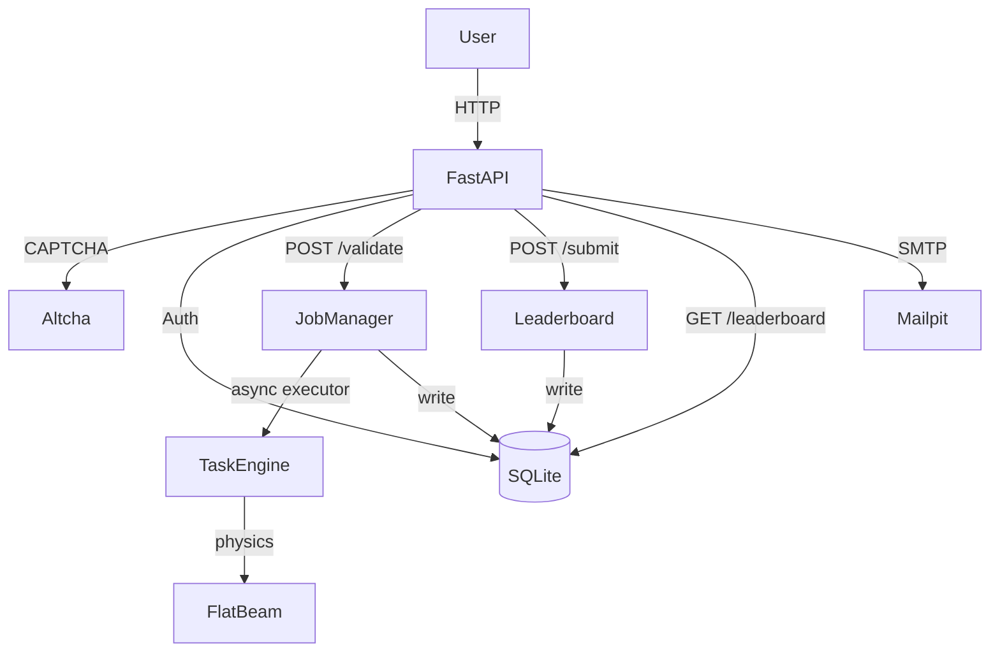

# SLACATHON 2026

AI optimization hackathon platform for accelerator physics. Competitors submit beam parameter sets via a REST API, receive physics-based scores, and compete on a public leaderboard.

## Features

- Pluggable task system — swap challenges via a single environment variable
- Async job validation — fire-and-poll for long-running physics simulations
- Email-based registration — CAPTCHA-protected sign-up with API key delivery
- Per-user quotas — configurable validation limits per key
- Leaderboard deduplication — identical submissions are ignored
- SQLite persistence — jobs, leaderboard entries, and users survive restarts
- Dev container — one-click VS Code environment with Mailpit included

## Technology Stack

| Layer | Technology |
|-------|-----------|
| Framework | FastAPI + Uvicorn / Gunicorn |
| Database | SQLite via SQLModel (SQLAlchemy) |
| Email | aiosmtplib + Jinja2 templates |
| CAPTCHA | Altcha (self-hosted proof-of-work) |
| Templates | Jinja2 (CRT-themed registration pages) |
| Testing | pytest + pytest-asyncio |

## Quick Start

```bash
git clone https://github.com/balticfish/slacathon26.git
cd slacathon26
python -m venv venv && source venv/bin/activate
pip install -r requirements.txt
cp .env.example .env          # edit as needed
uvicorn app.main:app --reload --host 0.0.0.0 --port 8000
```

Server available at `http://localhost:8000/slacathon26`.

## First API Call

```python
import requests, time

BASE = "http://localhost:8000/slacathon26"
HEADERS = {"X-API-Key": "key_123"}   # dev seed key

r = requests.post(f"{BASE}/validate", headers=HEADERS,
                  json={"input": {"q1": 2.25, "q2": -2.22, "q3": 0.96, "d2": 0.033, "d3": 1.413}})
job_id = r.json()["job_id"]

while True:
    j = requests.get(f"{BASE}/jobs/{job_id}", headers=HEADERS).json()
    if j["status"] == "completed":
        print(j["result"])   # {"score": ..., "solved": ..., "message": ...}
        break
    time.sleep(1)
```

## Architecture



## Documentation

| Section | Description |
|---------|-------------|
| [Getting Started](docs/getting-started/installation.md) | Install, configure, run |
| [Architecture](docs/architecture/overview.md) | Components, data flow, design patterns |
| [API Reference](docs/api/overview.md) | All endpoints with examples |
| [Development](docs/development/local-setup.md) | Local dev, testing, contributing |
| [Deployment](docs/deployment/docker.md) | Docker, production, environment vars |
| [Task Development](docs/guides/task-development.md) | Write a new optimization task |
| [Troubleshooting](docs/troubleshooting/common-issues.md) | Common errors and fixes |

## Authors

- A. Halavanau (SLAC)
- C.J. Takacs (ex-SLAC)
- Claude Code

## License

Stanford License
