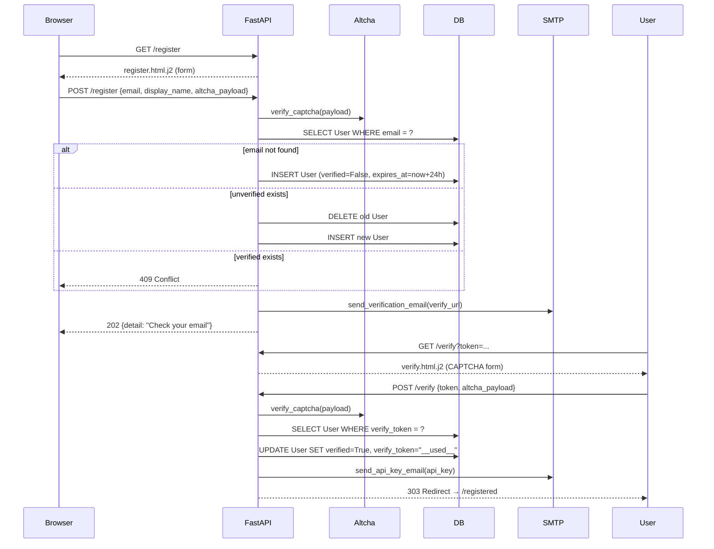
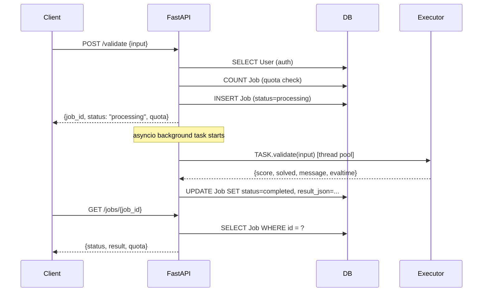
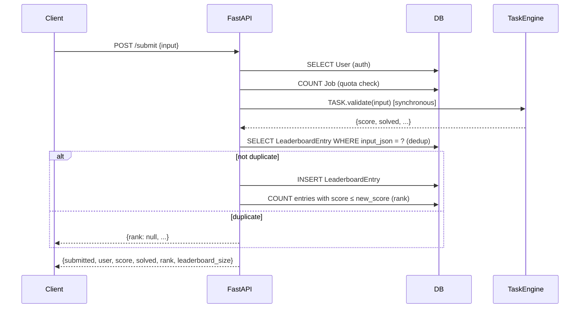

# Data Flow

## Registration Flow

```mermaid
sequenceDiagram
    Browser->>FastAPI: GET /register
    FastAPI-->>Browser: register.html.j2 (form)
    Browser->>FastAPI: POST /register {email, display_name, altcha_payload}
    FastAPI->>Altcha: verify_captcha(payload)
    FastAPI->>DB: SELECT User WHERE email = ?
    alt email not found
        FastAPI->>DB: INSERT User (verified=False, expires_at=now+24h)
    else unverified exists
        FastAPI->>DB: DELETE old User
        FastAPI->>DB: INSERT new User
    else verified exists
        FastAPI-->>Browser: 409 Conflict
    end
    FastAPI->>SMTP: send_verification_email(verify_url)
    FastAPI-->>Browser: 202 {detail: "Check your email"}

    User->>FastAPI: GET /verify?token=...
    FastAPI-->>User: verify.html.j2 (CAPTCHA form)
    User->>FastAPI: POST /verify {token, altcha_payload}
    FastAPI->>Altcha: verify_captcha(payload)
    FastAPI->>DB: SELECT User WHERE verify_token = ?
    FastAPI->>DB: UPDATE User SET verified=True, verify_token="__used__"
    FastAPI->>SMTP: send_api_key_email(api_key)
    FastAPI-->>User: 303 Redirect → /registered
```

## Validation Job Flow

```mermaid
sequenceDiagram
    Client->>FastAPI: POST /validate {input}
    FastAPI->>DB: SELECT User (auth)
    FastAPI->>DB: COUNT Job (quota check)
    FastAPI->>DB: INSERT Job (status=processing)
    FastAPI-->>Client: {job_id, status: "processing", quota}
    Note over FastAPI: asyncio background task starts
    FastAPI->>Executor: TASK.validate(input) [thread pool]
    Executor-->>FastAPI: {score, solved, message, evaltime}
    FastAPI->>DB: UPDATE Job SET status=completed, result_json=...

    Client->>FastAPI: GET /jobs/{job_id}
    FastAPI->>DB: SELECT Job WHERE id = ?
    FastAPI-->>Client: {status, result, quota}
```

## Leaderboard Submit Flow

```mermaid
sequenceDiagram
    Client->>FastAPI: POST /submit {input}
    FastAPI->>DB: SELECT User (auth)
    FastAPI->>DB: COUNT Job (quota check)
    FastAPI->>TaskEngine: TASK.validate(input) [synchronous]
    TaskEngine-->>FastAPI: {score, solved, ...}
    FastAPI->>DB: SELECT LeaderboardEntry WHERE input_json = ? (dedup)
    alt not duplicate
        FastAPI->>DB: INSERT LeaderboardEntry
        FastAPI->>DB: COUNT entries with score ≤ new_score (rank)
    else duplicate
        FastAPI-->>Client: {rank: null, ...}
    end
    FastAPI-->>Client: {submitted, user, score, solved, rank, leaderboard_size}
```
