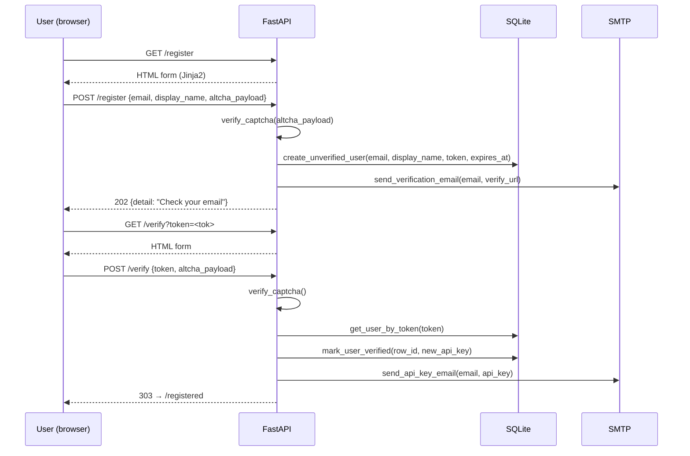
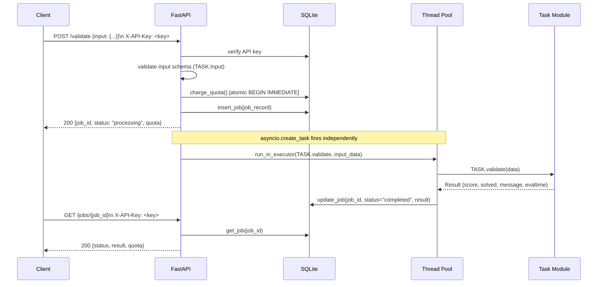
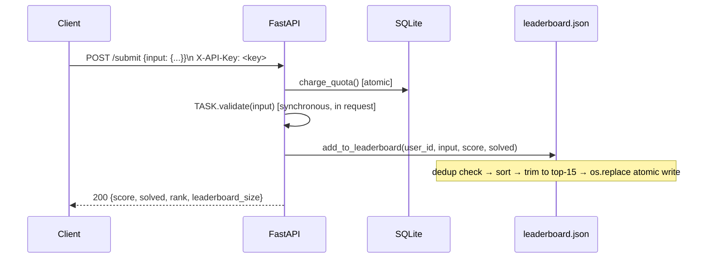

# Data Flow

## Registration Flow

## Validation Job Flow

## Submit to Leaderboard Flow

## Quota Enforcement

Quota is stored durably in `quota_charges` table. On every `/validate` and `/submit` call:

1. `db.charge_quota()` opens `BEGIN IMMEDIATE`.
2. Counts existing charges for `user_id`.
3. If `count >= limit` → `ROLLBACK` → raises `RuntimeError` → HTTP 429.
4. Otherwise inserts charge row → `COMMIT`.

Limit source of truth = `TASK.MAX_VALIDATIONS_PER_USER` (loaded at startup). Default fallback = `SLACATHON_MAX_VALIDATIONS_PER_USER` env var (default 10000).

## Background Cleanup

A background `asyncio` task (`_cleanup_loop`) runs every `SLACATHON_CLEANUP_INTERVAL_MINUTES` (default 10) minutes. It calls `db.delete_expired_unverified_users()`, which removes rows where `verified=0` and `expires_at < now()`.
