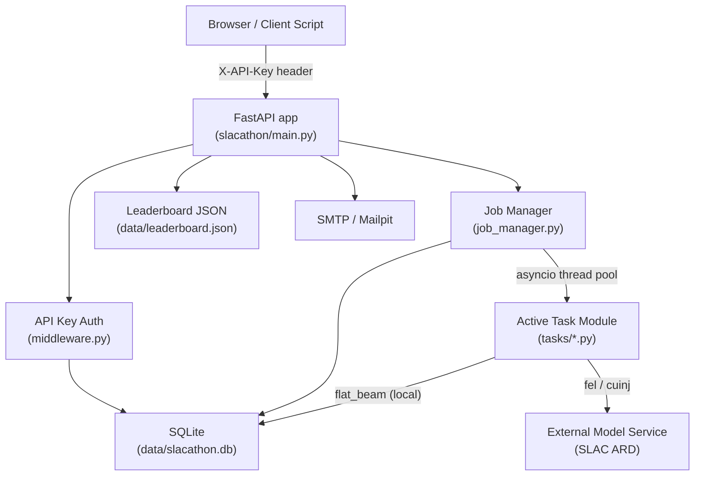

# Architecture Overview

SLACathon is a single-process FastAPI web service that hosts pluggable beam-physics optimization challenges. Participants submit parameter vectors via a REST API and receive scores from a task-specific objective function.

## Component Map

## Layers

| Layer | Module(s) | Responsibility |
|---|---|---|
| HTTP routing | `main.py` | Route definitions, request parsing, response shaping |
| Auth | `middleware.py` | API key validation against SQLite; leaderboard read/write |
| Job pipeline | `job_manager.py` | Job creation, background execution, quota enforcement |
| Task protocol | `tasks/base.py`, `tasks/*.py` | Objective function, input schema, scoring constants |
| Persistence | `db.py` | SQLite CRUD for users, jobs, quota_charges |
| Configuration | `settings.py` | `pydantic-settings` with `SLACATHON_` prefix |
| Registration | `main.py` + `captcha.py` + `email_service.py` | Self-serve signup with CAPTCHA + email verification |

## Key Design Decisions

**Single replica, `Recreate` strategy.** SQLite does not support multiple concurrent writers. The Kubernetes deployment intentionally runs one pod and replaces it on update rather than doing a rolling restart.

**Async HTTP + sync task execution.** FastAPI is async; task `validate()` functions are synchronous (potentially CPU-bound). Jobs are dispatched via `asyncio.get_running_loop().run_in_executor(None, ...)` so they run in a thread pool without blocking the event loop.

**Atomic quota enforcement.** `db.charge_quota()` uses `BEGIN IMMEDIATE` to prevent TOCTOU races — the check and insert happen in a single transaction.

**Pluggable tasks.** Tasks are plain Python modules discovered by `task_loader.py` at startup. Switching tasks requires only an environment variable change (`SLACATHON_ACTIVE_TASK`).

**Leaderboard as flat JSON.** The top-15 leaderboard is intentionally simple plain JSON, written atomically via `os.replace()`. Jobs and users live in SQLite.

## See Also

- [Data Flow](data-flow.md) — request lifecycle end-to-end
- [Guides / Writing a Task](../guides/writing-a-task.md) — task protocol specification
