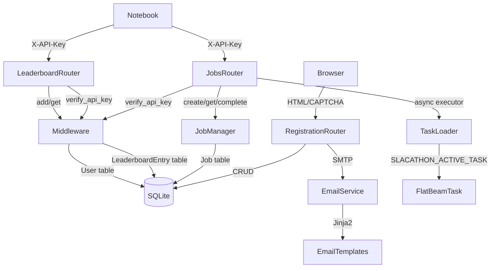
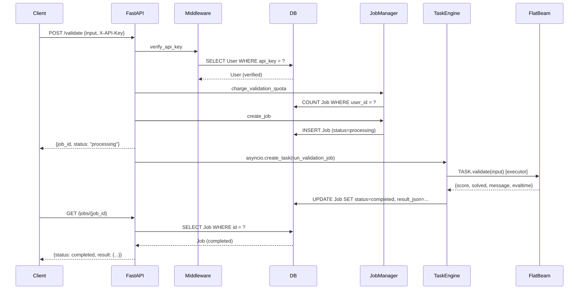
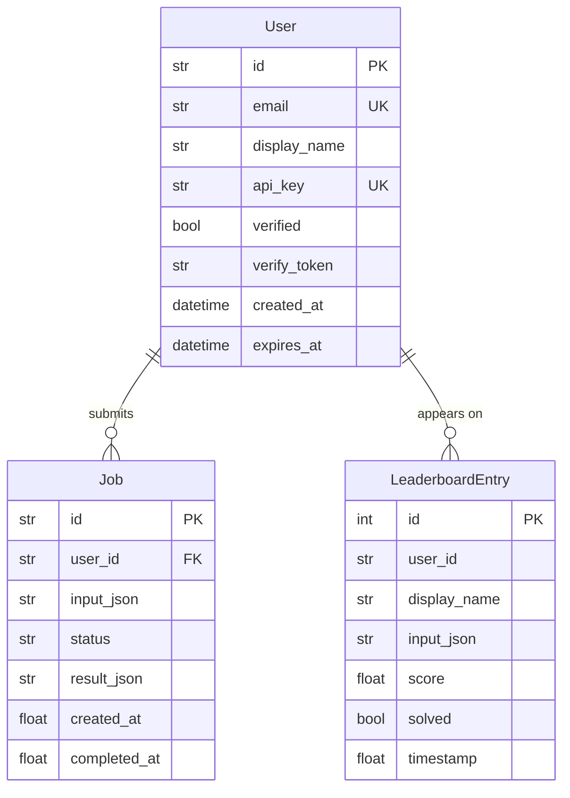

# Architecture Overview

SLACATHON 2026 is a single-process FastAPI application backed by SQLite. It serves a web registration flow, a REST API for optimization competitors, and a public leaderboard — all in one service.

## Component Map



## Layers

| Layer | Location | Responsibility |
|-------|----------|---------------|
| HTTP routing | `app/routers/` | Parse requests, inject dependencies, return responses |
| Auth + leaderboard | `app/core/middleware.py` | `verify_api_key`, `get_display_name`, `add_to_leaderboard`, `get_leaderboard` |
| Job management | `app/core/job_manager.py` | Create/complete jobs, quota checks, JSON safety |
| Task loading | `app/core/task_loader.py` | Dynamic import of active task, protocol validation |
| Database | `app/db.py` | SQLite engine, session factory, `create_db_and_tables`, seeding |
| Models | `app/models/` | User, Job, LeaderboardEntry (SQLModel) |
| Email | `app/email_service.py` | aiosmtplib + Jinja2 templates |
| CAPTCHA | `app/captcha.py` | Altcha proof-of-work challenge/verify |
| Tasks | `app/tasks/` | Pluggable physics evaluation modules |
| Templates | `app/templates/`, `app/page_templates/` | Landing pages + registration forms |

## Request Lifecycle — Validation Job



## Pluggable Task System

Tasks live in `app/tasks/<name>.py`. Each must satisfy the `Task` protocol defined in `app/tasks/base.py`:

```python
class Task(Protocol):
    Input: type[BaseModel]           # Pydantic input model
    Result: type[BaseModel]          # Pydantic result model
    TASK_NAME: str
    INPUT_LABELS: list[str]
    BOUNDS: list[tuple[float, float]]
    TARGET: float
    MINIMIZE: bool
    FAILURE_SCORE: float
    MAX_VALIDATIONS_PER_USER: int
    def validate(self, data: BaseModel) -> BaseModel: ...
```

Active task is set via `SLACATHON_ACTIVE_TASK` and loaded once at startup into a module-level cache. See [Task Development Guide](../guides/task-development.md) for how to add a task.

## Data Model



## Key Design Decisions

- **SQLite** — appropriate for a single-process contest; no external service required
- **Async job queue via `asyncio.create_task`** — validation runs in a thread executor; the HTTP response returns immediately
- **Input JSON deduplication** — leaderboard ignores identical submissions (sorted-key JSON comparison)
- **Background cleanup loop** — expired unverified registrations purged every N minutes (avoids DB bloat)
- **No migrations** — `SQLModel.metadata.create_all()` is code-first; acceptable for a short-lived contest

See [Components](components.md) for module-level details and [Data Flow](data-flow.md) for the registration flow.
